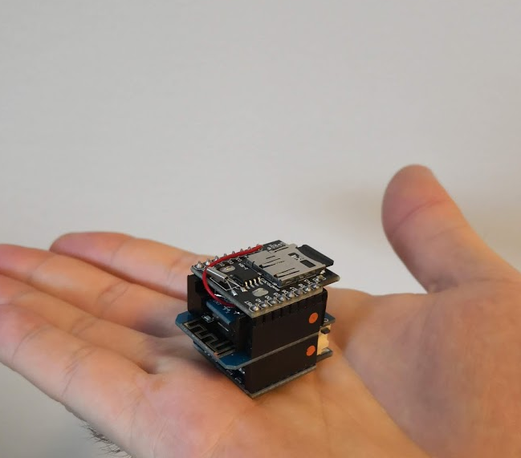

# WibblyWobbly
Tiny data collector based on a ESP8266

# Parts

* Wemos D1 https://www.aliexpress.com/item/10pcs-D1-PRO-Battery-Shield-D1-mini-Mini-NodeMcu-4M-bytes-Lua-WIFI-Internet-of-Things/32832670731.html
* Battery shield https://www.aliexpress.com/item/D1-Mini-Battery-Shield-Lithium-Battery-Charging-Boost-With-LED-Light-Module-Mini-Micro-USB-Interface/32798209192.html
* RTC SD shield https://www.aliexpress.com/item/RTC-DS1307-Real-Time-Clock-DataLog-Shield-for-Micro-SD-WeMos-D1-Mini-RTC-DS1307-Clock/32839371626.html
* Accelerometer/Gyro GY-521 https://www.aliexpress.com/item/MPU-6050-3-Axis-gyroscope-acce-lerometer-module-3V-5V-compatible-For-Arduino/2035920870.html

# Assembly
